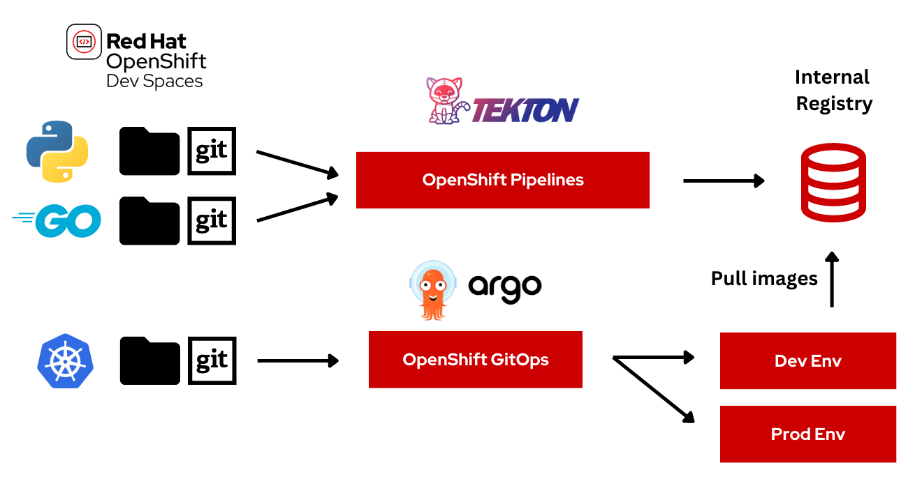

# OpenShift GitOps Demo (Tekton + Argo CD)

The aim of this demo is to show how to interconnect [Tekton](https://tekton.dev/) Continuous Integration (CI) capabilities to [Argo CD](https://argoproj.github.io/argo-cd/) enhanced features for Continuous Delivery (CD) with [Red Hat OpenShift](https://try.openshift.com).



The flow of this demo is:

* Create and start manually or automatically [OpenShift Pipelines](https://www.openshift.com/learn/topics/ci-cd) to build container images
* Edit code from [OpenShift DevSpaces](https://developers.redhat.com/products/codeready-workspaces/overview)
* Scan container images with [Quay.io](https://quay.io)
* Sync application with [OpenShift GitOps](https://www.openshift.com/learn/topics/gitops/) in Dev and Prod environments

The demo is based on the [Vote App](https://github.com/openshift/pipelines-tutorial) 2-tier app (Python Flask frontend + Go backend):


## Assets and repos

### Git

We use three git repos.

#### App source repos

Vote App source repos (Frontend + Backend):
* [Vote App UI](https://github.com/blues-man/pipelines-vote-ui)
* [Vote App API](https://github.com/blues-man/pipelines-vote-api)

#### GitOps repo

This repo, used to store Kubernetes manifests and Argo application:
* [Vote App GitOps](https://github.com/blues-man/vote-app-gitops)

There are 2 environments managed with Kustomize:
* **dev**: used to deploy and sync manifests in a **Dev** environment
* **prod**: used to deploy and sync manifests **Prod**, uses [Argo CD Sync Waves](https://argoproj.github.io/argo-cd/user-guide/sync-waves/) to order manifests sync.

#### Create a Personal Access Token for GitHub

The pipelines will update the Kubernetes manifests for the applications, so they need to push to the both Vote App UI and Vote App API repos.

Create a [Personal Access Token](https://docs.github.com/en/github/authenticating-to-github/keeping-your-account-and-data-secure/creating-a-personal-access-token) for your user, it will be used later.

### Container Registry

In this demo we use [Quay.io](https://quay.io) as public container registry with private access to store container images.

Example:

* quay.io/bluesman/vote-api:latest
* quay.io/bluesman/vote-ui:latest


## Setup

To run this demo you need **OpenShift >=4.7** with cluster-admin privileges.

### Quay.io

#### Account

Create an account on [Quay.io](https://quay.io) if you do not already have one.

#### Repositories

Create two repositories with public access (pull), you will use credentials in the next step to push container images.

From right-side menu, click **Create New Repository**

Create two repositories:

* vote-ui
* vote-api

Flag it as **Public Repository** and click **Create Public Repository** 


Repositories are created and listed:


#### Create secret

* Login to quay.io in the web user interface and click on your username in the top right corner.
* Select **account settings**.
* Click the blue hyperlink **Generate Encrypted Password**.
* Re-enter your password when prompted.
* Copy the password


### Setup OpenShift

Login to OpenShift Web Console to install prerequisites.

### Install Operators


#### OpenShift Pipelines

OpenShift Pipelines is provided as an add-on on top of OpenShift that can be installed via an operator available in the OpenShift OperatorHub. Follow these instructions in order to install OpenShift Pipelines on OpenShift via the OperatorHub.


From the left-side menu under **Administrator** perspective, go to **Operators**-> **OperatorHub**. In the search box, search for _pipelines_, then click to **OpenShift Pipelines Operator**:


From the description view, click *Install* to review all installation settings.


Ensure *Update Channel* is set to *stable* , and click *Install* to start installing the Operator.


After few seconds, the installation should be completed with success and you can verify it looking at *Status* column, check if the status is *Succeeded*.


#### OpenShift GitOps

Log into OpenShift Web Console as a cluster admin and navigate to the **Administrator** perspective and then **Operators** &rarr; **OperatorHub**. 

In the **OperatorHub**, search for *OpenShift GitOps* and follow the operator install flow to install it.


##### Add permission to Argo CD service account

**IMPORTANT** Give permission to the Argo CD service account to control the cluster:
```bash
oc adm policy add-cluster-role-to-user cluster-admin -z openshift-gitops-argocd-application-controller -n openshift-gitops
```

Once OpenShift GitOps is installed, an instance of Argo CD is automatically installed on the cluster in the `openshift-gitops` namespace and link to this instance is added to the application launcher in OpenShift Web Console.


##### Log into Argo CD dashboard

Argo CD upon installation generates an initial admin password which is stored in a Kubernetes secret. In order to retrieve this password, run the following command to decrypt the admin password:

```
oc extract secret/openshift-gitops-cluster -n openshift-gitops --to=-
```

Click on Argo CD from the OpenShift Web Console application launcher and then log into Argo CD with `admin` username and the password retrieved from the previous step.


#### OpenShift DevSpaces

CodeReady Workspace is an in-browser IDE  that will be used to edit and test the code from OpenShift with a pre-build Workspace from a Devfile.

Log into OpenShift Web Console as a cluster admin and navigate to the **Administrator** perspective and then **Operators** &rarr; **OperatorHub**. 

In the **OperatorHub**, search for *OpenShift DevSpaces* and follow the operator install flow to install it.

In the Red Hat OpenShift DevSpaces pop-up window, click the **Install** button.


On the Install Operator screen, leave default option:

* Installation mode: A specific project on the cluster
* Installed Namespace: Pick an existing project → openshift-workspaces

##### Creating an instance of OpenShift DevSpaces

To create an instance of the Red Hat OpenShift DevSpaces Operator, in the left panel, navigate to the **Operators** → **Installed Operators** section.

In the Installed Operators screen, click the Red Hat OpenShift DevSpaces name.

In the Operator Details screen, in the **Details** tab, inside of the Provided APIs section, click the **Create Instance** link.

The Create CheCluster page contains the configuration of the overall OpenShift DevSpaces instance to create. It is the CheCluster Custom Resource. Keep the default values.

To create the codeready-workspaces cluster, click the **Create** button in the lower left corner of the window.

On the Operator Details screen, in the Red Hat OpenShift DevSpaces Cluster tab, click on the codeready-workspaces link.

To navigate to the codeready-workspaces instance, click the link under Red Hat OpenShift DevSpaces URL.

NOTE
The installation might take more than 5 minutes. The URL appears after the Red Hat OpenShift DevSpaces installation finishes.

### Setup vote-ci project

1. Create a new Project for the CI part with Tekton.

```bash
oc new-project vote-ci
```


2. Create a Secret with your Quay.io credentials with the encrypted password you copied before:

```bash
oc create secret docker-registry quay-secret --docker-server=quay.io --docker-username=<QUAY_USERNAME> --docker-password=<ENCRYPTED_PASSWORD>
```
3. Create a Secret with your GitHub Personal Access Token

```yaml
apiVersion: v1
kind: Secret
metadata:
  name: git-user-pass
  annotations:
    tekton.dev/git-0: https://github.com
type: kubernetes.io/basic-auth
stringData:
  username: <github user>
  password: <github personal access token>
```
Save it to a file with your credentials and create the secret:

```bash
oc create -f git-user-pass.yaml
```

3. Link Secrets to pipeline Service Account.

NOTE: Pipelines Operator installs by default a `pipeline` Service Account in all projects. This service account is used to run non-privileged containers and builds across the cluster.  

```bash
oc secret link pipeline quay-secret
oc secret link pipeline git-user-pass
```

4. Fork repos

In order to enable webhooks, fork source code repos to use them in pipelines:

* [vote-api](https://github.com/blues-man/pipelines-vote-api)
* [vote-ui](https://github.com/blues-man/pipelines-vote-ui)


4. Clone vote-api repo


```bash
git clone https://github.com/blues-man/pipelines-vote-api
cd pipelines-vote-api
```

5. Create Tekton pipeline manifests

Change the GitOps repo to your fork:
```bash
sed -i 's/bluesman/yourquayuser/g' k8s/pipeline.yaml
sed -i 's/blues-man/yourgithubuser/g' k8s/pipeline.yaml
```

```bash
oc create -f k8s/vote-api-pvc.yaml
oc create -f k8s/git-update-deployment-task.yaml
oc create -f k8s/pipeline.yaml
oc create -f k8s/triggertemplate.yaml
oc create -f k8s/triggerbinding.yaml
oc create -f k8s/eventlistener.yaml
oc create -f k8s/el-route.yaml
```


7. Clone vote-ui repo

```bash
cd ..
git clone https://github.com/blues-man/pipelines-vote-ui
cd pipelines-vote-ui
```


8. Create pipeline manifests

Change the GitOps repo to your fork:
```bash
sed -i 's/bluesman/yourquayuser/g' k8s/pipeline.yaml
sed -i 's/blues-man/yourgithubuser/g' k8s/pipeline.yaml
```

```bash
oc create -f k8s/vote-ui-pvc.yaml
oc apply  -f k8s/git-update-deployment-task.yaml
oc create -f k8s/pipeline.yaml
oc create -f k8s/triggertemplate.yaml
oc create -f k8s/triggerbinding.yaml
oc create -f k8s/eventlistener.yaml
oc create -f k8s/el-route.yaml
```

## Demo flow

The goal is to show how to OpenShift can create and connect the CI and CD part with Tekton and ArgoCD, using CRW and Quay.io for the Inner and Outer Loop.

### 1. Pipelines overview


#### 1. Start vote-api pipeline

Start vote-api pipeline manually. 

From the left-side menu under **Developer** perspective, go to **Pipelines**.

Click to **vote-api** pipeline.

From right side menu, click **Start**.

In **GIT_REPO** use your fork of the **vote-api** repo

In **IMAGE_NAME** put your **vote-api** container image from Quay.io

Leave all other settings as default.

Select **PVC** under **Workspace** section and select **vote-api-pvc** persistent volume claim.

Click **Start**


#### 2. Start vote-ui with a Webhook

Tekton supports **Tekton Triggers** to enable automation and web hooks to Pipelines. All settings have been already installed from previous command, and both pipelines support web hooks.


From **Topology** view, click to **el-vote-ui** Deployment, go into Routes section and and copy the **el-vote-ui**  Route URL.


Once you have the URL copied to your clipboard, navigate to the code repository fork that you have on GitHub.

From your fork page top-right menu, click **Settings**. Then from result left-side menu, click **Webhook**, then from right side click **Add webhooks**.

In the next screen, paste your link into the **Payload URL** field. You can leave the secret token field blank.

Change the Content Type to **application/json**.

Finally, click on **Add Webhook**.


NOTE: If you forked the repo, update the `TriggerTemplate` with your vote-ui repo on quay.io reference adding the `IMAGE_NAME` parameter, otherwise it will fallback to `quay.io/bluesman/vote-ui`:

```bash
oc edit triggertemplate vote-ui
```

```yaml
...
    spec:
      params:
      - name: APP_NAME
        value: $(tt.params.git-repo-name)
      - name: GIT_REPO
        value: $(tt.params.git-repo-url)
      - name: GIT_REVISION
        value: $(tt.params.git-revision)
      - name: IMAGE_NAME
        value: quay.io/<your-username>/vote-ui
```

Do some change to the source code and verify that the pipeline starts.

You can also use CodeReadyWorkspaces for that (change this URL with the one for your OpenShift DevSpaces):

[](https://codeready-openshift-workspaces.apps.cluster-6ef7.6ef7.sandbox74.opentlc.com/factory?url=https://github.com/blues-man/pipelines-vote-ui&policies.create=peruser)


NOTE: you can also trigger the Pipeline start by changing and pushing the code at the CRW step later

#### 3. Quay.io security scan

* Verify generated images have been pushed to Quay.
* Verify **vote-ui** image has been scanned with no vulnerabilities found


### 2. Argo CD for DEV project

We will pre-deploy the DEV environment in the **vote-app-dev** project.

1. Fork this [vote-app-gitops](https://github.com/blues-man/vote-app-gitops) repository 
2. Clone your repository fork in the **main** branch:

```bash
git clone https://github.com/blues-man/vote-app-gitops.git
cd vote-app-gitops
```

2. Update Argo CD application **repoURL** with your fork, this will be used to deploy the app to the DEV environment

```yaml
apiVersion: argoproj.io/v1alpha1
kind: Application
metadata:
  name: vote-app-dev
  namespace: openshift-gitops
spec:
  destination:
    namespace: vote-app-dev
    server: https://kubernetes.default.svc 
  project: default 
  source: 
    path: environments/dev
    repoURL: https://github.com/blues-man/vote-app-gitops
    targetRevision: main
  syncPolicy: 
    automated:
      prune: true
      selfHeal: false
    syncOptions:
    - CreateNamespace=true
```
3. Update all references to quay.io with your repos for vote-ui and vote-api images:
```bash
sed -i 's/bluesman/yourquayuser/g' k8s/api-deployment.yaml k8s/ui-deployment.yaml
git commit
git push
```
4. Create Argo CD Application to deploy DEV env
```bash
oc apply -f argo/vote-app-dev.yaml
```


#### 1. Verify App deployment

Go to **Topology** view in **vote-app-dev** Project.


#### 2. Access the app

Access the app from vote-ui **Route** clicking on the Python icon and then accessing Route URL.


#### 3. Edit app in OpenShift DevSpaces


Edit source code from CRW by clicking on the little crw icon next to the **vote-ui** in the Topology view. This will launch Eclipse Che Factory reading the dev environment from the Devfile in the vote-ui repository.

This will open CRW and you can demo how to edit and run the app from an IDE.

In CRW, from **Run Tasks** click **Install dependencies** and **Run Python app**.

This will open an embedded window with the app running locally.


#### 4. Detect drifts

Let Argo CD detect a drift between what declared in Git and what it is available in the cluster.

Change **vote-ui** replicas to 2 from OpenShift and verify the status is **Out of Sync** on Argo CD.

TIP: if the dashboard page doesn't update, try to hit the Refresh button from the Argo CD web console


#### 5. Sync the app

Sync manually the app from the Argo CD console, as we declared in our `Application` that we don't want to _self-heal_ for DEV project.

From top menu, click **SYNC**.

From right side window, click **SYNCHRONIZE** and leave default settings.

This will rollback the **vote-ui** deployment replicas to 1.


### 3. Argo CD for PROD project

We create the PROD environment directly from Argo CD Web console this time.

Before doing that, update all the references to quay.io with your images also for the **main** branch.

```bash
git checkout main
sed -i 's/bluesman/yourquayuser/g' k8s/api-deployment.yaml k8s/ui-deployment.yaml
git commit
git push
```

Access Argo CD Web console, from homepage click on top-left to the **+NEW APP** button.

Under **General**:

* **Application**: vote-app-prod
* **Project**: default
* **Sync Policy**: Automatic
* * Prune resources: true
* * Self Heal: true
* **Sync Options**: Auto-create namespace


Under **Source** section:

* **Reposiroty URL**: Add your forked repo, e.g. https://github.com/blues-man/vote-app-gitops
* **Revision**: main
* **Path**: environments/prod

Under **Destination** section:

* **Cluster URL**: https://kubernetes.default.svc
* **Namespace**: vote-app-prod

Click **CREATE**


Review auto-generated `Application` manifest:


```yaml
apiVersion: argoproj.io/v1alpha1
kind: Application
metadata:
  name: vote-app-prod
  namespace: openshift-gitops
spec:
  destination:
    namespace: vote-app-prod
    server: https://kubernetes.default.svc 
  project: default 
  source: 
    path: environments/prod
    repoURL: https://github.com/blues-man/vote-app-gitops
    targetRevision: main
  syncPolicy: 
    automated:
      prune: true
      selfHeal: true
    syncOptions:
    - CreateNamespace=true
```


#### 1. Review deployment order

PROD environment is using Sync Waves, this means Kubernetes manifests in the _main_ branch are
annotated with sync weves to order manifests deployment.

```yaml
metadata:
  annotations:
    argocd.argoproj.io/sync-wave: "0"
```

1. API Deployment
2. API Service
3. UI Deployment
4. UI Service
5. UI Route


#### 2. Verify app is deployed in vote-app-prod Project

Verify vote-ui and vote-api are deployed also in **vote-app-prod** project now.

NOTE: OpenShift DevSpaces icons are not present in the Topology view this time, because we haven't annoted the Deployment for that, as this is a Prod app!

#### 3. Auto detect drift

Change **vote-ui** replicas to 2 from OpenShift Web Console, Argo CD will automatically sync and auto-heal in this case.


### 4. Make a change to PROD from GitHub with a Pull Request

1. Create a new feature branch in the GitHub repo called **feature-ha**
2. Change **ui-deployment.yaml** with ```replicas:2```
3. Create PR
4. Merge into main
5. Prod app is with 2 replicas


Well done!

